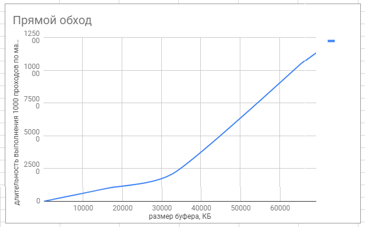
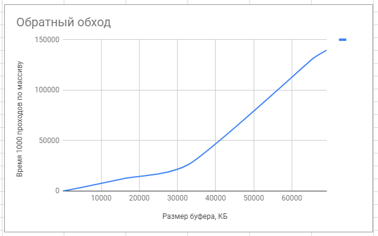
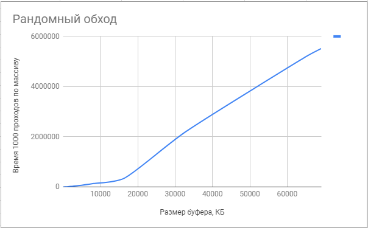

```Shellsession
investigation:
travel_variant: "straight"
experiments:
- experiment:
  number: 1
 input_data:
  buffer_size: "16kb"
  results:
  duration: "9ms"
- experiment:
number: 2
 input_data:
  buffer_size: "32kb"
  results:
  duration: "18ms"
number: 3
 input_data:
  buffer_size: "64kb"
  results:
  duration: "38ms"  
number: 4
 input_data:
  buffer_size: "128kb"
  results:
  duration: "76ms"
number: 5
 input_data:
  buffer_size: "256kb"
  results:
  duration: "150ms"  
number: 6
 input_data:
  buffer_size: "512kb"
  results:
  duration: "300ms"  
 number: 7
 input_data:
  buffer_size: "1024kb"
  results:
  duration: "612ms" 
 number: 8
 input_data:
  buffer_size: "2048kb"
  results:
  duration: "1265ms" 
 number: 9
 input_data:
  buffer_size: "4096kb"
  results:
  duration: "2569ms" 
 number: 10
 input_data:
  buffer_size: "8192kb"
  results:
  duration: "5068ms" 
 number: 11
 input_data:
  buffer_size: "16384kb"
  results:
  duration: "10137ms"
 number: 12
 input_data:
  buffer_size: "32768kb"
  results:
  duration: "20873ms"
 number: 13
 input_data:
  buffer_size: "65536kb"
  results:
  duration: "105175ms" 
 number: 14
 input_data:
  buffer_size: "69120kb"
  results:
  duration: "113140ms"


investigation:
travel_variant: "reverse"
experiments:
- experiment:
  number: 1
 input_data:
  buffer_size: "16kb"
  results:
  duration: "10ms"
- experiment:
number: 2
 input_data:
  buffer_size: "32kb"
  results:
  duration: "21ms"
number: 3
 input_data:
  buffer_size: "64kb"
  results:
  duration: "43ms"  
number: 4
 input_data:
  buffer_size: "128kb"
  results:
  duration: "89ms"
number: 5
 input_data:
  buffer_size: "256kb"
  results:
  duration: "180ms"  
number: 6
 input_data:
  buffer_size: "512kb"
  results:
  duration: "351ms"  
 number: 7
 input_data:
  buffer_size: "1024kb"
  results:
  duration: "701ms" 
 number: 8
 input_data:
  buffer_size: "2048kb"
  results:
  duration: "1481ms" 
 number: 9
 input_data:
  buffer_size: "4096kb"
  results:
  duration: "2970ms" 
 number: 10
 input_data:
  buffer_size: "8192kb"
  results:
  duration: "6188ms" 
 number: 11
 input_data:
  buffer_size: "16384kb"
  results:
  duration: "12687ms"
 number: 12
 input_data:
  buffer_size: "32768kb"
  results:
  duration: "26030ms"
 number: 13
 input_data:
  buffer_size: "65536kb"
  results:
  duration: "131418ms" 
 number: 14
 input_data:
  buffer_size: "69120kb"
  results:
  duration: "139645ms"
  
  investigation:
travel_variant: "random"
experiments:
- experiment:
  number: 1
 input_data:
  buffer_size: "16kb"
  results:
  duration: "93ms"
- experiment:
number: 2
 input_data:
  buffer_size: "32kb"
  results:
  duration: "190ms"
number: 3
 input_data:
  buffer_size: "64kb"
  results:
  duration: "390ms"  
number: 4
 input_data:
  buffer_size: "128kb"
  results:
  duration: "814ms"
number: 5
 input_data:
  buffer_size: "256kb"
  results:
  duration: "1560ms"  
number: 6
 input_data:
  buffer_size: "512kb"
  results:
  duration: "3212ms"  
 number: 7
 input_data:
  buffer_size: "1024kb"
  results:
  duration: "7471ms" 
 number: 8
 input_data:
  buffer_size: "2048kb"
  results:
  duration: "21470ms" 
 number: 9
 input_data:
  buffer_size: "4096kb"
  results:
  duration: "51179ms" 
 number: 10
 input_data:
  buffer_size: "8192kb"
  results:
  duration: "138719ms" 
 number: 11
 input_data:
  buffer_size: "16384kb"
  results:
  duration: "348945ms"
 number: 12
 input_data:
  buffer_size: "32768kb"
  results:
  duration: "2194297ms"
 number: 13
 input_data:
  buffer_size: "65536kb"
  results:
  duration: "5235777ms" 
 number: 14
 input_data:
  buffer_size: "69120kb" 
  results:
  duration: "5515403ms"
```



